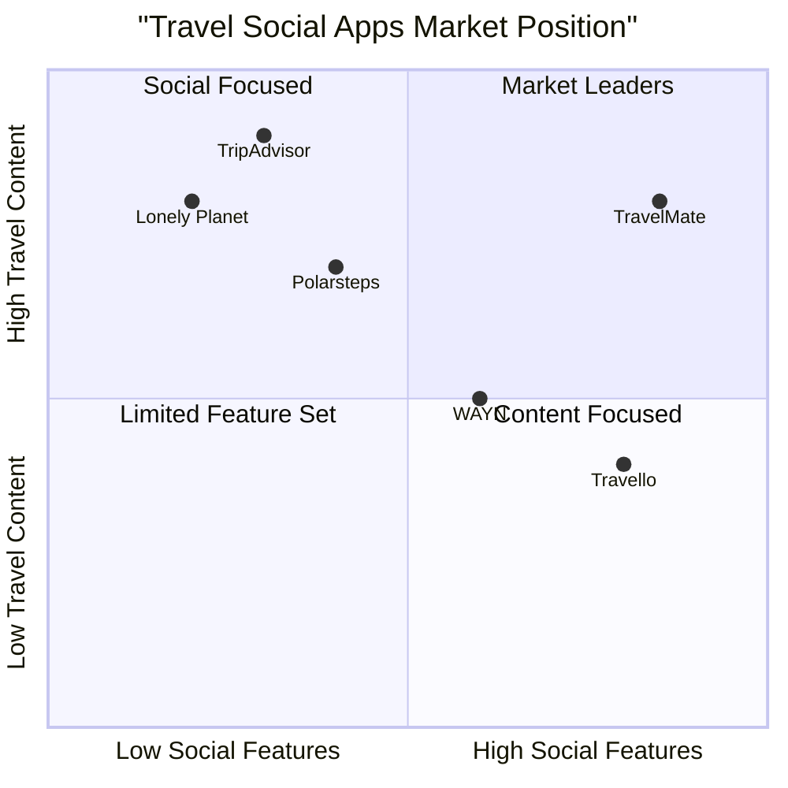

# TravelMate - Social Travel Platform PRD

## 1. Project Overview

### 1.1 Introduction
TravelMate is a social networking platform designed specifically for travel enthusiasts, enabling them to share their travel experiences, connect with like-minded travelers, and access authentic travel information through user-generated content.

### 1.2 Original Requirements
- Create a full-stack application for travel enthusiasts
- Enable users to upload images, videos, and posts about their tours
- Allow users to share their location and hotel information
- Implement hotel and tourist spot rating system
- Provide in-app chat functionality for user communication
- Foster social connections between travel enthusiasts

### 1.3 Product Goals
1. Create an engaging platform that connects travelers worldwide through shared experiences and real-time interactions
2. Provide authentic, user-generated travel content and ratings to help travelers make informed decisions
3. Build a trusted community of travel enthusiasts with seamless communication capabilities

## 2. User Stories

### 2.1 Core User Stories
1. As a travel enthusiast, I want to share my travel experiences through photos, videos, and posts so that I can inspire others and preserve my memories
2. As a traveler, I want to discover authentic reviews and ratings of hotels and tourist spots so that I can make informed decisions for my trips
3. As a social user, I want to connect and chat with other travelers so that I can get personalized recommendations and build meaningful connections
4. As a trip planner, I want to access location information of hotels and attractions so that I can efficiently plan my itinerary
5. As a content creator, I want to build a following of travel enthusiasts so that I can establish myself as a trusted travel influencer

## 3. Market Analysis

### 3.1 Competitive Analysis

1. TripAdvisor
- Pros:
  * Extensive database of hotels and attractions
  * Robust review system
  * Established user base
- Cons:
  * Limited social networking features
  * No real-time chat functionality
  * Corporate feel vs. personal connection

2. Travello
- Pros:
  * Strong social networking focus
  * Location-based connection features
  * Modern interface
- Cons:
  * Limited review system
  * Smaller user base
  * Basic content sharing capabilities

3. WAYN (Where Are You Now)
- Pros:
  * Travel-focused social network
  * Trip planning features
  * Community-driven content
- Cons:
  * Outdated interface
  * Limited mobile functionality
  * Less active user base

4. Polarsteps
- Pros:
  * Automatic trip tracking
  * Beautiful visual storytelling
  * Interactive maps
- Cons:
  * Limited social features
  * No chat functionality
  * Focus on tracking over community

5. Lonely Planet Community
- Pros:
  * Trusted brand name
  * High-quality content
  * Global coverage
- Cons:
  * Limited social features
  * No real-time interaction
  * Traditional forum format

### 3.2 Competitive Positioning

## 4. Technical Requirements

### 4.1 Core Features

#### P0 (Must Have)
1. User Authentication and Profiles
   - Social media login integration
   - Profile customization
   - Travel preferences settings

2. Content Management
   - Image and video upload
   - Post creation with rich text
   - Location tagging
   - Privacy settings for content

3. Location Services
   - Real-time location sharing
   - Hotel location mapping
   - Tourist spot discovery
   - Interactive maps

4. Rating System
   - Hotel ratings and reviews
   - Tourist spot ratings and reviews
   - Rating categories (cleanliness, service, value, etc.)
   - Photo verification for reviews

5. Messaging System
   - Real-time chat
   - Media sharing in chat
   - Chat history
   - Online status indicators

#### P1 (Should Have)
1. Social Features
   - Follow/unfollow users
   - Activity feed
   - Content sharing
   - User recommendations

2. Search and Discovery
   - Advanced search filters
   - Personalized recommendations
   - Trending destinations
   - Popular users

3. Trip Planning
   - Itinerary creation
   - Collaborative planning
   - Save locations
   - Travel tips

#### P2 (Nice to Have)
1. Advanced Features
   - Story format for quick updates
   - Live streaming
   - Virtual tours
   - AI-powered recommendations

2. Community Features
   - Travel groups
   - Events and meetups
   - Travel challenges
   - User badges

### 4.2 Technical Architecture

1. Frontend
   - React.js for web application
   - Tailwind CSS for styling
   - Socket.io for real-time features
   - React Native for mobile apps

2. Backend
   - Node.js/Express.js server
   - MongoDB for main database
   - Redis for caching
   - AWS S3 for media storage

3. APIs and Services
   - Google Maps API
   - Cloud messaging for notifications
   - Authentication services
   - Media processing services

## 5. UI Design Draft

### 5.1 Key Screens

1. Home Feed
   - Stories bar at top
   - Scrollable content feed
   - Quick access to chat
   - Navigation bar

2. Explore Page
   - Map view
   - List view toggle
   - Search filters
   - Trending content

3. Profile Page
   - User info and stats
   - Content grid/list
   - Travel map
   - Rating history

4. Chat Interface
   - Chat list
   - Individual chat windows
   - Media sharing options
   - Online status

5. Location Detail
   - Photos and videos
   - Ratings and reviews
   - Map location
   - Nearby attractions

## 6. Open Questions

1. Content Moderation
   - How will we ensure the authenticity of reviews and ratings?
   - What measures will be in place for content moderation?

2. Monetization Strategy
   - Will we implement premium features?
   - How can we integrate booking services?

3. Scale Considerations
   - How will we handle peak usage during travel seasons?
   - What's the data storage strategy for media content?

4. Privacy and Security
   - How will we protect user location data?
   - What privacy controls should be available for shared content?

## 7. Success Metrics

1. User Engagement
   - Daily active users
   - Time spent in app
   - Content creation rate
   - Chat activity

2. Content Metrics
   - Number of posts/reviews
   - Media uploads
   - Rating submissions
   - Location shares

3. Community Growth
   - User registration rate
   - User retention rate
   - Social connections made
   - Active communities

4. Technical Performance
   - App load time
   - Chat response time
   - Media upload success rate
   - Server uptime

## 8. Timeline and Milestones

### Phase 1 (Months 1-3)
- Basic user authentication
- Content upload functionality
- Location sharing
- Basic profile features

### Phase 2 (Months 4-6)
- Rating system implementation
- Chat functionality
- Social features
- Search and discovery

### Phase 3 (Months 7-9)
- Advanced features
- Performance optimization
- Community features
- Mobile apps